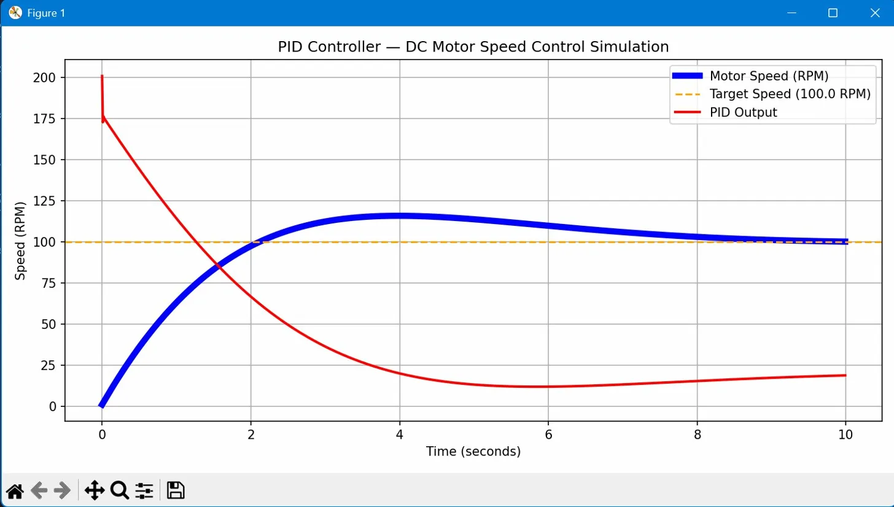

# pid-controller-python
# PID Controller — DC Motor Speed Control Simulation

A Python simulation of a PID (Proportional-Integral-Derivative) controller built to model DC motor speed control behaviour. The project simulates a real control loop including motor friction, overshoot, settling time, and the individual contribution of each PID term — all without requiring any physical hardware.

---

## Background

During my final year project AUTOM8 — a tri-modular campus delivery robot with stair traversal capability — I worked with 12 DC motors across 6 L298N motor drivers. I understood motor control at the hardware level but the control theory behind speed regulation was not part of the implementation. This project was built specifically to close that gap — to understand mathematically why a proportional controller alone is insufficient and why all three PID terms are necessary in a real motor system.

---

## What This Project Does

The simulation runs a PID control loop over 10 seconds with a time step of 0.01 seconds — meaning 1000 calculations per second. The motor starts from rest at 0 RPM and the controller works to bring it to a target of 100 RPM as smoothly as possible.

A friction constant of 0.1 is applied every step to simulate real mechanical load resistance. This single addition changes the entire behaviour of the system — without friction a simple proportional controller is sufficient. With friction the integral term becomes essential because KP alone generates insufficient force to overcome the resistance at small error values, causing the motor to stop permanently short of the target. This condition is known as steady state error.

The simulation records motor speed and PID output at every time step and plots both on the same graph, making it possible to observe the controller's effort alongside the motor's response simultaneously.

---

## How The PID Loop Works

At every time step the controller calculates three values:

**Proportional term** — reacts to the current error. The further the motor is from target the harder it pushes. Fast to respond but cannot eliminate small leftover errors caused by friction.

**Integral term** — accumulates all past errors over time. Slowly builds up enough force to overcome friction and push the motor to exact target speed. Risk: if the motor is physically blocked for a long time the integral accumulates to dangerously large values — a condition called integral windup — causing violent uncontrolled acceleration when the blockage clears.

**Derivative term** — reacts to how fast the error is changing. If the motor is approaching the target too quickly the derivative applies a braking effect to prevent overshoot. Most sensitive term — must be kept small because the time step DT = 0.01 amplifies derivative values by a factor of 100.

```
output = (KP × error) + (KI × integral) + (KD × derivative)
```

---

## Parameters

| Parameter | Value | Description |
|---|---|---|
| TARGET_SPEED | 100.0 RPM | Desired motor speed |
| KP | 2.0 | Proportional gain |
| KI | 0.8 | Integral gain |
| KD | 0.3 | Derivative gain |
| DT | 0.01 s | Control loop time step — 100 iterations per second |
| FRICTION | 0.1 | Simulated mechanical load resistance per time step |

---

## What The Graph Shows



The blue line is motor speed. The orange dashed line is the target speed. The red line is the PID output signal — the controller's effort at each moment.

At t=0 the output starts at approximately 200. This is because at the first step integral and derivative are both zero, so only KP contributes — output = 2.0 × 100 = 200. As the motor accelerates toward target the error reduces and output drops. The motor overshoots slightly past 100 RPM — at this point error becomes negative and the controller reduces output further. After settling, the output stabilises at a small positive value rather than zero because friction continuously requires a small push to maintain target speed.

---

## What I Achieved

- Built a working PID control loop from scratch using only numpy and matplotlib
- Demonstrated steady state error caused by friction — KP alone stops the motor short of target
- Demonstrated KI recovering from steady state error and reaching exact target speed
- Visualised both motor speed and controller output simultaneously on a single graph
- Connected simulation concepts directly to real hardware experience from AUTOM8 — L298N drivers, DC motors, and mechanical friction on staircase terrain
- Understood integral windup as a practical safety risk in physical robots

---

## Limitations

- Motor model is simplified — real motors have back EMF, torque curves, and variable inertia that are not modelled here
- Friction is constant — in a real system like AUTOM8 friction changes between flat ground and staircase terrain
- No integral clamping implemented — integral windup is discussed but not solved in this version
- No sensor feedback modelled — simulation assumes perfect speed knowledge at every step; real implementation requires encoder readings
- Output has no PWM mapping — real motor drivers like L298N accept 0–255 PWM signals, not raw floating point numbers
- Single motor only — AUTOM8 required coordinated control of 12 motors simultaneously

---

## Real Implementation Gap

| This Simulation | Real Motor Controller |
|---|---|
| `current_speed` assumed known | Encoder reads actual shaft speed |
| Raw float output | PWM signal 0–255 via `analogWrite()` |
| Constant friction | Variable friction by terrain |
| Python loop | Arduino `millis()` based loop |
| No output limits | Output clamped to safe hardware range |

---

## Requirements

```
pip install numpy matplotlib
```

## Run

```
python pid_controller.py
```

Saves graph as `pid_response.png` in the same directory.

---

## Author

Vatsalkumar Chauhan  
B.Tech Robotics and Automation Engineering  
Parul University, Vadodara  
GitHub: github.com/vatsalkumar-chauhan
